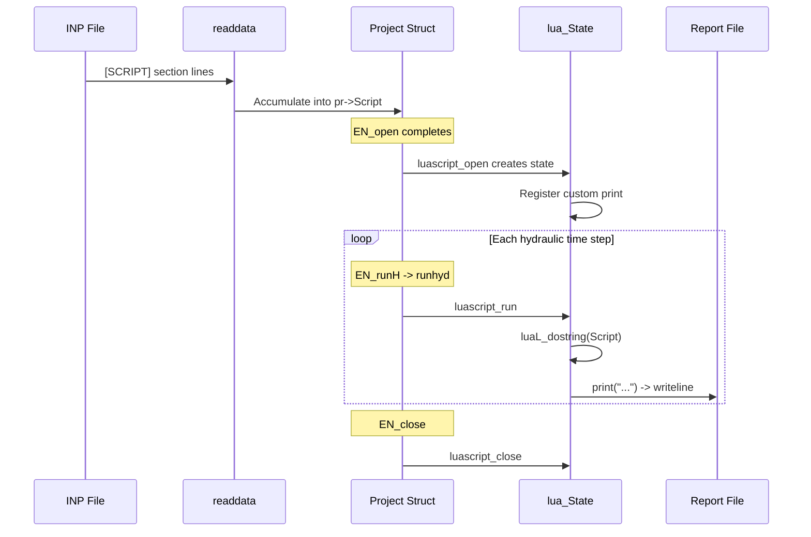

# Lua Scripting API for EPANET

## Overview

Add a `[SCRIPT]` section to INP files containing Lua code. Override Lua's `print()` to write to the EPANET report. Execute the script after each hydraulic time step solve.

## New Files

### [src/luascript.h](src/luascript.h) and [src/luascript.c](src/luascript.c)

Isolated Lua integration module with three functions:

- `luascript_open(Project *pr)` -- Create a `lua_State`, register a custom `print()` that calls `writeline(pr, ...)`, and pre-compile the script from `pr->Script`. No-op if `pr->Script` is NULL.
- `luascript_run(Project *pr)` -- Execute the stored script via `luaL_dostring(L, pr->Script)`. No-op if no Lua state.
- `luascript_close(Project *pr)` -- Call `lua_close()` and NULL out `pr->lua`. No-op if no Lua state.

The `print()` override receives the `Project*` as a Lua upvalue (via `lua_pushlightuserdata` + `lua_pushcclosure`), retrieves it with `lua_touserdata(L, lua_upvalueindex(1))`, concatenates all arguments with a tab separator (matching standard Lua `print` behavior), and calls `writeline(pr, buf)`.

These files go in `src/` and are automatically picked up by the existing `file(GLOB ... src/*.c src/*)` in CMakeLists.txt. Lua headers are accessible because `epanet2` links `lua_static` which has `PUBLIC` include directories.

## Modified Files

### 1. [src/types.h](src/types.h) -- Section enum and Project struct

Add `_SCRIPT` to `SectionType` (before `_END`):

```c
_COORDS, _VERTICES, _LABELS, _BACKDROP, _TAGS, _LEAKAGE, _SCRIPT, _END
```

Add two fields to the `Project` struct (after the `MapFname` / temp file names block):

```c
char  *Script;     // Lua script source from [SCRIPT] section
void  *lua;        // Lua state (lua_State*)
```

### 2. [src/text.h](src/text.h) -- Section name constant

Add after `s_END`:

```c
#define   s_SCRIPT    "[SCRIPT]"
```

### 3. [src/enumstxt.h](src/enumstxt.h) -- Section text array

Add `s_SCRIPT` before `s_END` in the `SectTxt[]` array (order must match enum):

```c
s_TAGS, s_LEAKAGE, s_SCRIPT, s_END,
```

### 4. [src/input2.c](src/input2.c) -- Parse script lines

Add to `newline()` switch (around line 325):

```c
case _SCRIPT:  return (scriptdata(pr, line));
```

Also in `readdata()`, add a special case at the blank-line check (line 196) so that blank lines inside `[SCRIPT]` are still passed through (Lua code may have meaningful blank lines):

```c
if (parser->Ntokens == 0)
{
    if (sect == _SCRIPT)
    {
        newline(pr, sect, line);
        continue;
    }
    // ... existing PATTERNS/CURVES handling ...
}
```

The `scriptdata()` function (defined in `luascript.c`) appends each raw line to `pr->Script` using `realloc`, growing the buffer as needed.

### 5. [src/epanet.c](src/epanet.c) -- Lifecycle and execution hook

**Include**: Add `#include "luascript.h"` at the top.

**EN_open / openproject return path**: After `openproject()` returns successfully, call `luascript_open(p)` to initialize the Lua state if a script was loaded.

**EN_runH** (line 549-565): After `runhyd()` returns without error, call `luascript_run(p)`:

```c
int DLLEXPORT EN_runH(EN_Project p, long *currentTime)
{
    int errcode;
    *currentTime = 0;
    if (!p->hydraul.OpenHflag) return 103;
    errcode = runhyd(p, currentTime);
    if (!errcode) luascript_run(p);  // <-- execute Lua script between timesteps
    if (errcode) errmsg(p, errcode);
    return errcode;
}
```

**EN_close** (line 346): Before `freedata(p)`, call `luascript_close(p)` to destroy the Lua state. Also free `p->Script` if allocated.

## Execution Flow



## Example INP Section

```
[SCRIPT]
print("Hydraulic time step completed")
```

This would write "Hydraulic time step completed" to the report file after every hydraulic solve.
